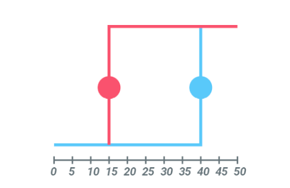
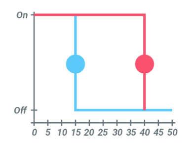
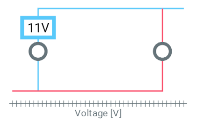
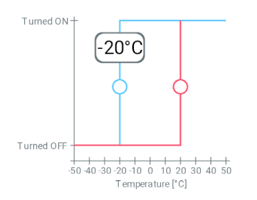

# react-native-hysteresis

UI component allowing to setup hysteresis range.
Most basic usage is to control heating or cooling devices.

## Installation

```sh
npm install react-native-hysteresis
OR
yarn add react-native-hysteresis
```

## Usage

```js
import { HysteresisControl } from "react-native-hysteresis";

// ...

<HysteresisControl
  range={{ min: 0, max: 50 }}
  step={5}
  initialValues={{ min: 10, max: 20 }}
  onChange={(e) => console.log(e)}
/>

```
#### For better understanding see the included example app.

##### Raw, without styling.

##### Inverted hysteresis lines.

##### Without axis labels just a title for X axis.
Some styling for control label. Example of voltage control.

##### With labels and title on axis
Example of temperature control.


## Contributing

See the [contributing guide](CONTRIBUTING.md) to learn how to contribute to the repository and the development workflow.

## License

MIT

